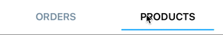
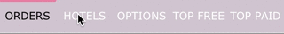
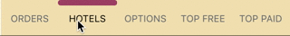

# react-native-custom-segmented-control
Native UI component for Segmented Control with custom style

`animationType: 'middle-line'`
`selectedLineAlign: 'text'`
`selectedLineMode: 'full'`


`animationType: 'open-and-close'`
`selectedLineAlign: 'text'`
`selectedLineMode: 'text'`


`animationType: 'middle-line'`
`selectedLineAlign: 'bottom'`
`selectedLineMode: 'text'`


`animationType: 'middle-line'`
`selectedLineAlign: 'top'`
`selectedLineMode: 'full'`


`animationType: 'middle-line'`
`selectedLineAlign: 'top'`
`selectedLineMode: 'full'`


`animationType: 'middle-line'`
`selectedLineAlign: 'text'`
`selectedLineMode: 'text'`


## Installation

- Install using `npm`:

	```
	npm install react-native-custom-segmented-control --save
	```

- Locate the module lib folder in your node modules:
	`PROJECT_DIR/node_modules/react-native-custom-segmented-control/lib`.

- Drag the `CustomSegmentedControl.xcodeproj` project file into your project

- Add `libCustomSegmentedControl.a` to your target's **Linked Frameworks and Libraries**.

## How To Use
Require the native component:

```js
import {CustomSegmentedControl} from 'react-native-custom-segmented-control'
```

Now use it in your jsx inside your `View`:

```jsx
<CustomSegmentedControl 
	style={{
		flex:1,
		backgroundColor: 'white',	
		marginVertical: 8
	}}
	textValues={['ORDERS','PRODUCTS' ]}
	selected={0}
	segmentedStyle={{
		selectedLineHeight: 2,
		fontSize:17,
		fontWeight: 'bold', // bold, italic, regular (default)
		segmentBackgroundColor: 'transparent',
		segmentTextColor: '#7a92a5',
		segmentHighlightTextColor: '#7a92a599',
		selectedLineColor: '#00adf5',
		selectedLineAlign: 'bottom', // top/bottom/text
		selectedLineMode: 'text', // full/text
		selectedTextColor: 'black',                                                  
		selectedLinePaddingWidth: 30,
		segmentFontFamily: 'system-font-bold'
	}}
	animation={{
		duration: 0.7,
		damping: 0.5,
		animationType: 'middle-line',
		initialDampingVelocity: 0.4
	}}
	onSelectedWillChange={(event)=> {
	}}
	onSelectedDidChange={(event)=> {
	}}
/>
```

##Properties

Attribute | Description
-------- | -----------
textValues | [Array] Array of strings which will be presented on the segmented control
selected | [int] The selected segment
onSelectedWillChange | [function] callback function will be called **before** the selected animation will take place
onSelectedDidChange | [function] callback function will be called **after** the selected animation will take place
animation | [Object] see [Animation Properties](README.md#animation-properties)
segmentedStyle | [Object] see [Segmented Style Properties](README.md#segmented-style-properties)

                                                 
##Segmented Style Properties
Attribute | Description
--------- | -----------
selectedLineHeight | [float] The selected line height. Default is 2
fontSize | [float] The segmented control text font size. Default is 14
segmentBackgroundColor | [Color] The segmented control background color. Default is `'black'`
segmentTextColor | [Color] The segmented control text color. Default is system default (blue)
selectedTextColor | [Color] The selected segment color
segmentHighlightTextColor | [Color] The segmnet highlight color. Default is black with alpha 0.5
segmentFontFamily | [Font/`'system-font-bold'`/`'system-font'`] The segmented control font. Default is `system-font` default
selectedLineColor | [Color] The selected line color. Default is 'black'
selectedLineAlign | [`'top'`/`'bottom'`/`'text'`] The selected line vertical alignment. Defualt is `'text'`
selectedLineMode | [`'full'`/`'text'`] The selected line mode. For determine if the line will be text width of full button width. Default is `'text'`
selectedLinePaddingWidth | [float] The selected line width padding. Default is 2


##Animation Properties
 
Attribute | Description
--------- | -----------
duration | [float] The animation duration. Default is 0.2 sec
damping | [float] The damping ratio for the spring animation. Default is 0 (no damping)
animationType | [`'default'`, `'middle-line'`, `'close-and-open'`] The transition animation type. Default is `'default'`
initialDampingVelocity | (float) The initial damping velocity. Default is 0
